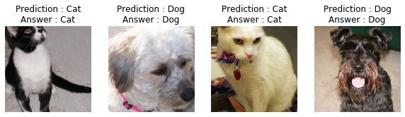

# Image Classification using MLP
PyTorch를 이용하여 개와 고양이 사진을 구분하는 MLP를 만든다.

---
## 1. Import
```python
### IMPORT
import matplotlib.pyplot as plt

import torch
from torch import nn
from torch import optim
import torch.nn.functional as F
from torchvision import datasets, transforms, models

import time
```
* `nn` : neural network module
* `optim` : optimizer module
* `datasets` : `ImageFolder` 만들기
* `transforms` : 이미지 편집 후 텐서로 변환
* `models` : pretrained model 불러오기
---
## 2. Training set
```python
### MAKING TRAINING SET

data_dir = 'Cat_Dog_data'

train_transforms = transforms.Compose([
	# transforms.Compose : input as a "list"
    transforms.RandomRotation(30),
    transforms.RandomResizedCrop(224),
    transforms.RandomHorizontalFlip(),
    transforms.ToTensor(),
    transforms.Normalize([0.485, 0.456, 0.406],
	# Transform to tensor before normalizing
                         [0.229, 0.224, 0.225]
                        )
])

test_transforms = transforms.Compose([
    transforms.Resize(255),
    transforms.CenterCrop(224),
    transforms.ToTensor(),
    transforms.Normalize([0.485, 0.456, 0.406],
                         [0.229, 0.224, 0.225]
                        )
])

train_data = datasets.ImageFolder(data_dir + '/train', transform=train_transforms)
test_data = datasets.ImageFolder(data_dir + '/test', transform=test_transforms)

trainloader = torch.utils.data.DataLoader(train_data, batch_size=64, shuffle=True)
testloader = torch.utils.data.DataLoader(test_data, batch_size=64)
```
* Train data는 `transforms`에서의 random augument 및 `DataLoader`의 shuffle을 통해서 학습 성능을 향상하고, Test data는 random하게 만들지 않는다.
* `transforms.Compose([])`는 입력을 `list`로 받는다. `nn.Sequential()`은 입력을 `tuple`로 받는 것과 비교
* Normalize는 tensor로의 변환 이후에 실행한다. (당연!)
* `transforms.Normalize(mean, std, inplace=False)` : data는 3-channel color이므로 각 채널의 평균과 표준편차값으로 normalize

---
## 3. Load Pretrained Model
```python
# Use GPU if it's availiable
device = 'cuda' if torch.cuda.is_available() else 'cpu'
print(f'Current device : {device}')

# load pretrained model
model = models.resnet101(pretrained=True)
print(model)

# Freeze params so we don't backprop through them
for param in model.parameters():
    param.requires_grad = False
```
* CUDA 사용
* **ResNet** 모델을 사용했다. **DenseNet**과 **ResNet**이 성능이 좋다고 한다.
* 찾아보니 **ResNet**은 *Residual CNN*이란 뜻이다. 101은 layer 수를 의미하는 듯. **ResNet**에 대한 설명은 [여기](https://bskyvision.com/644)와 [여기](http://blog.naver.com/PostView.nhn?blogId=laonple&logNo=221259295035) 참고, 다른 CNN 모델들은 [여기](https://ratsgo.github.io/deep%20learning/2017/10/09/CNNs/) 참고.
### 출력 :
```
Current device : cuda
ResNet(
  (conv1): Conv2d(3, 64, kernel_size=(7, 7), stride=(2, 2), padding=(3, 3), bias=False)
  (bn1): BatchNorm2d(64, eps=1e-05, momentum=0.1, affine=True, track_running_stats=True)
  (relu): ReLU(inplace=True)
  (maxpool): MaxPool2d(kernel_size=3, stride=2, padding=1, dilation=1, ceil_mode=False)
  (layer1): Sequential(
    (0): Bottleneck(
      (conv1): Conv2d(64, 64, kernel_size=(1, 1), stride=(1, 1), bias=False)
      (bn1): BatchNorm2d(64, eps=1e-05, momentum=0.1, affine=True, track_running_stats=True)
      (conv2): Conv2d(64, 64, kernel_size=(3, 3), stride=(1, 1), padding=(1, 1), bias=False)
      (bn2): BatchNorm2d(64, eps=1e-05, momentum=0.1, affine=True, track_running_stats=True)
      (conv3): Conv2d(64, 256, kernel_size=(1, 1), stride=(1, 1), bias=False)
      (bn3): BatchNorm2d(256, eps=1e-05, momentum=0.1, affine=True, track_running_stats=True)
      (relu): ReLU(inplace=True)
      (downsample): Sequential(
        (0): Conv2d(64, 256, kernel_size=(1, 1), stride=(1, 1), bias=False)
        (1): BatchNorm2d(256, eps=1e-05, momentum=0.1, affine=True, track_running_stats=True)
      )
    )
    
	....	(생략)


  )
  (avgpool): AdaptiveAvgPool2d(output_size=(1, 1))
  (fc): Linear(in_features=2048, out_features=1000, bias=True)
)
```
* `fc`에만 집중하면 된다. Classifier가 2048개의 입력을 받고 1000개의 출력을 낸다. 이걸 output 갯수가 2개인 binary classifier로 다시 만들어준다.
* `fc` 이외 나머지 parameter들은 `param.requires_grad = False`를 이용하여 _**"반드시"**_ 고정시켜주자.
---
## 4. Create a New Classifier
```python
# Make a new classifier to train
model.fc = nn.Sequential(
	# nn.Sequential : input as a "tuple" (not list)
    nn.Linear(2048, 512),
    nn.ReLU(),
    nn.Dropout(p=0.2),
    nn.Linear(512, 2),
    nn.LogSoftmax(dim=1)
)

# Criterion
criterion = nn.NLLLoss()

# Optimizer : ONLY train classifier params, freezing feature params.
optimizer = optim.Adam(model.fc.parameters(), lr=0.003)
```
* `model`의 `fc`만 갈아끼우자.
* 기억하기 : `nn.Sequential`의 입력은 `tuple`
* perceptron 순서 : Linear Transform -> Activaton -> Dropout
    - `Linear` -> `ReLU` -> `Dropout`
    - output layer는 Dropout하지 않는다.
* `NLLLoss` : Negative Log Likelihood Loss, NLL loss를 최소화하면 cross entropy를 최소화하는 꼴이 나온다고 한다.
	- 주의 : 입력을 _확률**의 로그값 $(logps)$**_ 으로 받는다.
	- 따라서 MLP의 output은 확률의 로그값인 $\text{LogSoftMax}$을 이용
* `optim.Adam`에서 backprop할 대상은 `model.fc.parameters()`뿐!

---
## 5. Training

```python
### TRAINING SESSION

# Get model ready
model.to(device);

epochs = 1
steps = 0
# training loss per batch=20
running_loss = 0
# every 20 steps, check test accuracy (i.e. 'batch of batch' size = 20)
print_every = 20

# step printer
print('Steps : ', end='')
total_len = len(trainloader) * epochs

# time tracer
total_batch_time = 0
start = time.time()

for e in range(epochs):
    for images, labels in trainloader:
        # trace steps
        steps += 1
        print('*', end='')
        
        # move inputs and outputs to device
        images, labels = images.to(device), labels.to(device)
        
        # initialize
        optimizer.zero_grad()
        
        # prop
        logps = model(images)
        loss = criterion(logps, labels)

        loss.backward()
        optimizer.step()
        
        # trace training loss
        running_loss += loss.item()
        
        if steps % print_every == 0:
            test_loss = 0
            accuracy = 0
            
            print('| ',
                  f'({steps/total_len * 100:.2f} %)')
            
            # turn off dropout
            model.eval()
            
            # turn off gradient tracing
            with torch.no_grad():
                for img, lbl in testloader:
                    img , lbl = img.to(device), lbl.to(device)
                    logps = model(img)
                    lss = criterion(logps, lbl)
                    
                    # trace test loss
                    test_loss += lss.item()
                    
                    # get accuracy
                    ps = torch.exp(logps)
                    _, top_class = ps.topk(1, dim=1)
                    isEqual = (top_class == lbl.view(*top_class.shape))
                    accuracy += torch.mean(isEqual.type(torch.FloatTensor)).item()
            
            print(f"Epoch {e+1}/{epochs}.. "
                  f"Train loss: {running_loss/print_every:.3f}.. "
                  f"Test loss: {test_loss/len(testloader):.3f}.. "
                  f"Test accuracy: {accuracy/len(testloader):.3f}")
            
            # initialize batch training loss
            running_loss = 0
            
            # turn on dropout
            model.train()
            
            total_batch_time += time.time() - start
            time_left = int((total_len - steps) * (total_batch_time / steps))
            print(f'Time left : {time_left//60}m {time_left%60}s')
            start = time.time()

            print('Steps : ', end='')
```
### 반드시 알아야 할 순서 : 
  1. model을 device로 옮긴다 : `model.to(device)`
  2. for loop으로 `trainloader`에서 batch를 하나씩 꺼내면서
     1. `input`과 `label`도 device로 옮긴 후
     2. optimizer gradient를 _**반드시**_ 초기화하고 : `.zero_grad()`
     3. propagation을 한다.
     4. loss를 추적중이라면 loss 합산을 잊지 말기
  3. 중간에 accuracy를 계산하고자 한다면
     1. `eval` 모드에 진입해서 dropout을 _**반드시**_ 끄고 : `model.eval()`
     2. gradient를 _**반드시**_ 끈 상태에서 : `with torch.no_grad():`
     3. feedforward를 진행한 후
     4. $p=\exp(logps)$로부터 classification 결과를 얻어 accuracy를 계산한다.
		- matching 여부 bool을 0,1 값으로 변환한 후 평균낸 것이 바로 accuracy
	 5. training을 계속하려면 _**반드시**_ `train`모드로 돌려놓는다. : `model.train()`

### 출력 : 
```
Steps : ********************|  (5.68 %)
Epoch 1/1.. Train loss: 0.177.. Test loss: 0.053.. Test accuracy: 0.980
Time left : 14m 12s
...
```
---
## 6. Inference
```python
### INFERENCE SESSION
import helper
import random

inferloader = torch.utils.data.DataLoader(test_data, batch_size=64, shuffle=True)

it = iter(inferloader)
for _ in range(random.randrange(0,10)):
    images_test, labels_test = next(it)

fig, axes = plt.subplots(figsize=(10,4), ncols=4)
for ii in range(4):
    ax = axes[ii]
    helper.imshow(images_test[ii], ax=ax)

images_test, labels_test = images_test.to(device), labels_test.to(device)

ans = lambda x: 'Cat' if x == 0 else 'Dog'

# SET TO EVAL MODE!
model.eval()

with torch.no_grad():
    _, class_test = torch.exp(model(images_test)).topk(1, dim=1)
    isEqual_test = (class_test == labels_test.view(*class_test.shape))
    acc_test = torch.mean(isEqual_test.type(torch.FloatTensor)).item()
print(f'Accuracy : {acc_test*100:.2f} %')

for ii in range(4):
    ax = axes[ii]
    ax.set_title(f'Prediction : {ans(class_test[ii].item())}\nAnswer : {ans(labels_test[ii].item())}')
```
* Accuracy 계산 때랑 거의 똑같이 하면 됨.
* `eval` 모드 진입 항상 까먹지 말 것!

### 출력 : 
```
Accuracy : 93.75 %
```

